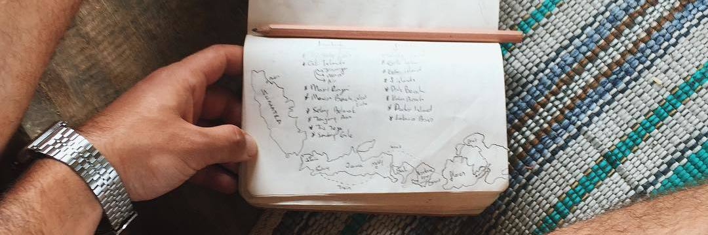

## 📔 Notebook

This is my personal and public notes. I'm hoping to grow it by the time, adding knowledge, thoughts, anything. I'll use here for remembering things and also letting my mind interact with yours. Feel free to open issues and pull requests!

## 🤔 How did it begin?

I have a lot of physical notebooks, it makes my desk full with them. Then I thought why not use the github repository as my place to write things. A good idea right? Let's get started...

## 📎 See Also

- [Meta Knowledge](https://github.com/RichardLitt/meta-knowledge) - Lists other notebooks.
- [Personal Site](https://razaqultegar.com) - My personal site, you can be read this notebook in another style.